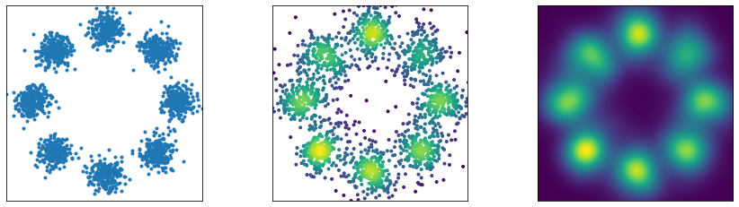

# Toy Generative Models

## Overview

A github repository with vanilla implementations of several generative models for 2D toy data. 

The following models are included: 
- Gaussian mixture models (GMMs) in `gmm.ipynb`
- variational autoencoders (VAEs) in `vae.ipynb`
- normalizing flows in `nf.ipynb`
- generative adversarial networks (GANs) in `gan.ipynb`
- diffusion models in `diffusion.ipynb`
- flow matching  in `flow_matching.ipynb`

The file `sampling.ipynb` shows how to sample from the distribution of interest using Langevin sampling.

Example: training data samples (left), generated samples using learned variational autoencoder (center) and estimated density from samples using kernel density estimation (right).

## Dependencies

Run the toy models in an environment with the following dependencies:

* numpy
* matplotlib
* scikit-learn
* pytorch
* torchdiffeq
